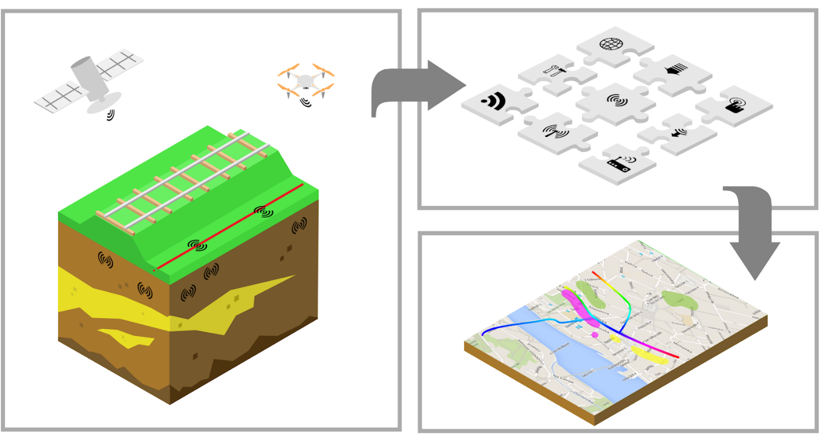

# Data Fusion Tools
Tools used in the project DigiTwin Waterkering en Ondergrond.




# Content

## Installation

DataFusionTools is a collection of several subpackages or distributions that can be either installed separately or as a whole project. Each subpackage may have a few heavy dependencies attached, therefore it is not recommended to install the whole DataFusionTools package if only a subpackage is needed in a project.
The installable sukpackages are: interpolation, machine_learning, sensitivity, spatial_utils, d_series_parser and visualisation.

### Installing all subpackages 
To install all the subpackages of the DataFusionTools at once, run the following:
```commandline
pip install git+https://github.com/DataFusionTools/datafusiontools.git
```

### Using the package as a developer

To install the package as a developer, you need first to check out the repository. Then, run the following command in the root of the repository:
```commandline
pip install -e .[testing]    
```
This will install the package in editable mode, so that any changes you make to the code will be reflected in the installed package. 
The [testing] flag will also install the dependencies needed for running the tests.

## Developers
Consortium consists of:

[Deltares](www.deltares.nl)

[TNO](www.tno.nl) 

[HKV](www.hkv.nl)

[Fugro](www.fugro.com/nl)

[Geodan](www.geodan.nl)
