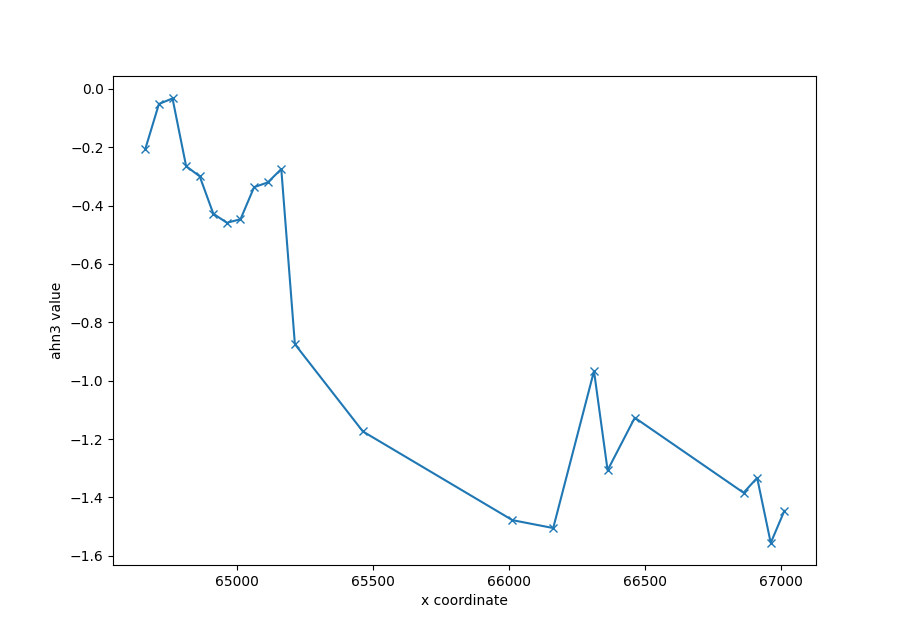
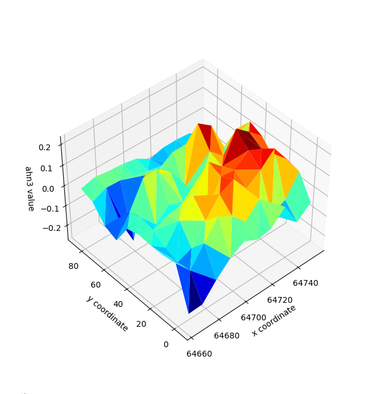

Get ahn values from a list of points
====================================

Following this tutorial the user can extract the elevation as described by the ahn.
The first step is to import the spatial utils module of the DataFusionTools.
And the Geometry class of the DataFusionTools.

.. code-block:: python

    import numpy as np
    import matplotlib.pyplot as plt
    import matplotlib.tri as mtri

    from datafusiontools._core.data_input import Geometry
    from datafusiontools.spatial_utils.ahn_utils import SpatialUtils

In this case the user wants to extract a line of 50 meter starting from point (64663.8, 393995.8).
To do that the user defines a list with all coordinates and calls the function
:py:meth:`datafusiontools.spatial_utils.ahn_utils.SpatialUtils.get_ahn_surface_line`.
The method support only the ahn3.

.. code-block:: python

    # define initial point location_1
    location_1 = Geometry(x=64663.8, y=393995.8, z=0)
    # create x,y line
    width = 50
    slice_line = [(location_1.x + width * x, location_1.y) for x in list(range(width))]
    # initialize spatial utils
    spatial_utils = SpatialUtils()
    # get surface line
    surface_line = spatial_utils.get_ahn_surface_line(np.array(slice_line))
    # sort surface line
    surface_line = sorted(surface_line, key=lambda x: x[1])

The results can be plotted using the following code

.. code-block:: python

    fig = plt.figure(figsize=(12, 12))
    ax = fig.add_subplot()

    ax.plot(np.array(surface_line)[:, 1] ,
              np.array(surface_line)[:, -1], marker="x")
    ax.set_xlabel("x coordinate")
    ax.set_ylabel("ahn3 value")
    plt.show()
        
The results can be seen in the figure bellow.

However, the function can also produce a 3D surface.
In the example appended bellow the user plot a 10X10m grid.

.. code-block:: python

    # define initial point location_1
    location_1 = Geometry(x=64663.8, y=393995.8, z=0)
    # create x,y line
    width, height = 10, 10
    slice_line = [(location_1.x + width*x, location_1.y + height*y) for x in list(range(width)) for y in list(range(height))]
    # initialize spatial utils
    spatial_utils = SpatialUtils()
    # get surface line
    surface_line = spatial_utils.get_ahn_surface_line(np.array(slice_line))

The results can be plotted using the following code

.. code-block:: python

    fig = plt.figure(figsize=(12, 12))
    ax = fig.add_subplot(projection='3d')
    triang = mtri.Triangulation(np.array(surface_line)[:, 1], np.array(surface_line)[:, 2])
    ax.plot_trisurf(triang, np.array(surface_line)[:, 3], cmap='jet')
    ax.set_xlabel("x coordinate")
    ax.set_ylabel("y coordinate")
    ax.set_zlabel("ahn3 value")
    plt.show()
    print("done")
        
The results can be seen in the figure bellow.

