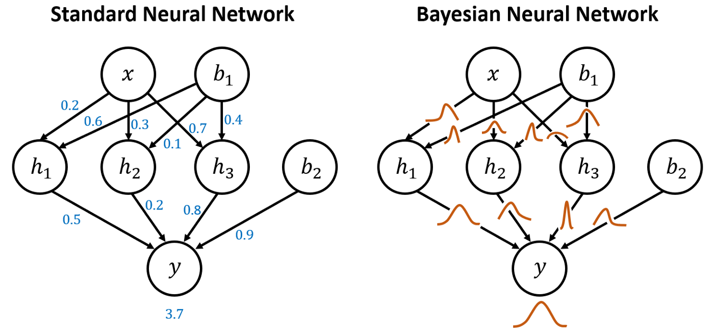
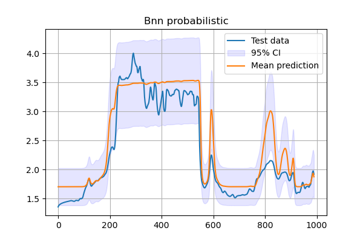
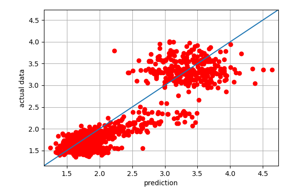
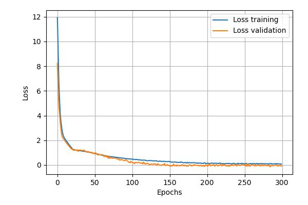

Bayesian Neural Networks
========================

Bayesian Neural Networks are quite a new concept in machine learning.
Therefore in this tutorial an effort is made to understand what are Bayesian Networks (BNNs)
and how they can be used to model uncertainties.

What is a BNN?
--------------

Basically a BNN is a machine learning method that combines neural networks with Bayesian inference.
The Bayesian approach is applied to all trainable (weights, bias etc.) variables of the network available,
which means that the BNN will try and find their marginal distribution.
The purpose of a BNN is to quantify uncertainties that are in the model with the help of 
weights and outputs. 

In the following figure the essential difference between a simple Neural Network and a BNN is shown.
While in the simple NN the connections after training are represented by a single value,
in the BNN these are represented by distributions.

Model example
-------------

First all the required packages should be imported. 

.. code-block:: python

    from datafusiontools._core.data_input import Data, Variable, Geometry
    from datafusiontools._core.utils import CreateInputsML, AggregateMethod
    import datafusiontools.machine_learning.enumeration_classes as class_enums
    from datafusiontools.machine_learning.bayesian_neural_network import BayesianNeuralNetwork
    import pickle
    from pathlib import Path

After the required packages are imported the user can use the function get_input_data found in the following snippet.

.. include:: ../_snippets/retrieve_inputs.rst

The :py:class:`datafusiontools.machine_learning.bayesian_neural_network.BayesianNeuralNetwork` class
can be initialized for the BNN to be trained. This can be seen in the snippet that follows.

.. code-block:: python

    # extract inputs
    training_data, target_data, validation_training, validation_target, feature_names = get_input_data()
    # initialize model
    nn = BayesianNeuralNetwork(
        classification=False,
        nb_hidden_layers=2,
        nb_neurons=[8, 8],
        activation_fct=class_enums.ActivationFunctions.sigmoid,
        optimizer=class_enums.Optimizer.Adadelta,
        epochs=300,
        batch=24,
        feature_names=feature_names,
        learning_rate = 0.0001,
        validation_features=validation_training,
        validation_targets=validation_target,
    )
    # Train model
    nn.train(
        training_data,
        target_data,
    )

After training the results of the process can be extracted by using functions embedded in the DataFusionTools package.

.. code-block:: python

    nn.predict(validation_training)
    nn.plot_cost_function(output_folder=Path("./test_bnn"))
    nn.plot_confidence_band(validation_target, output_folder=Path("./test_bnn"))
    nn.plot_fitted_line(validation_target, output_folder=Path("./test_bnn"))

Which produce the following graphs

