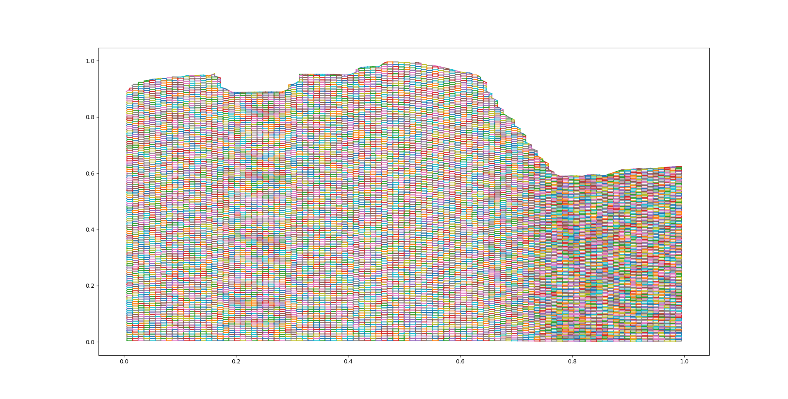
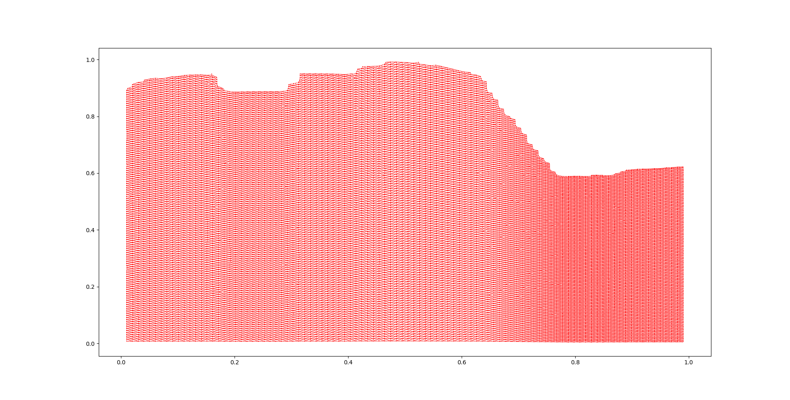
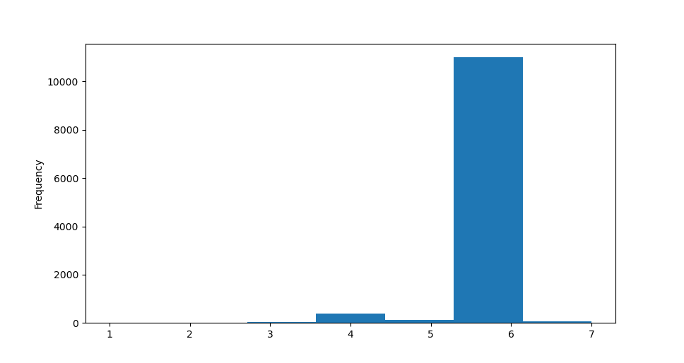
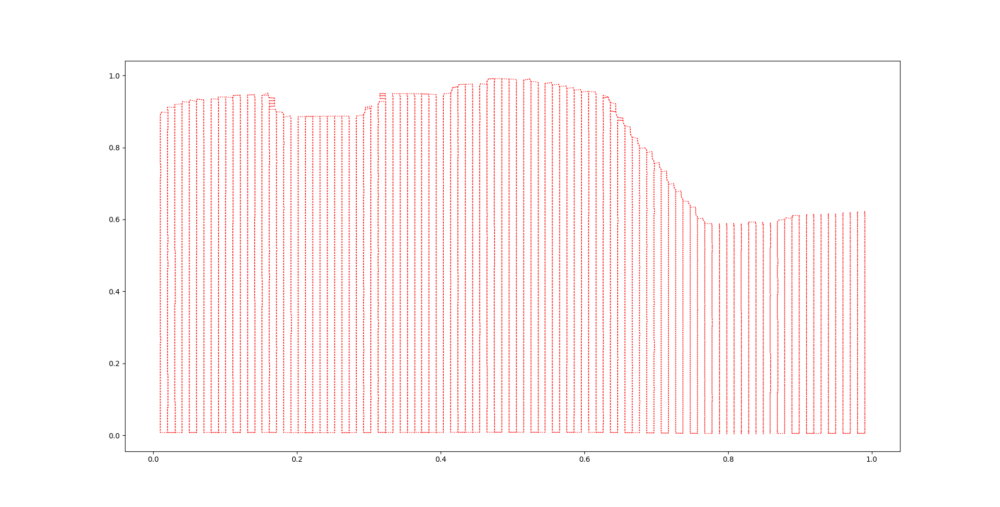
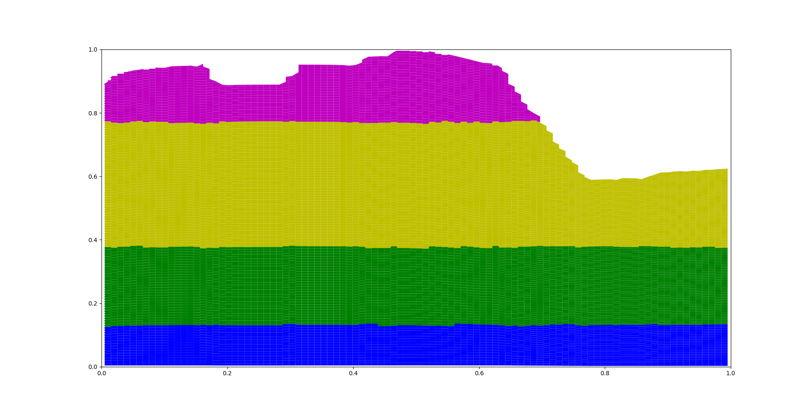
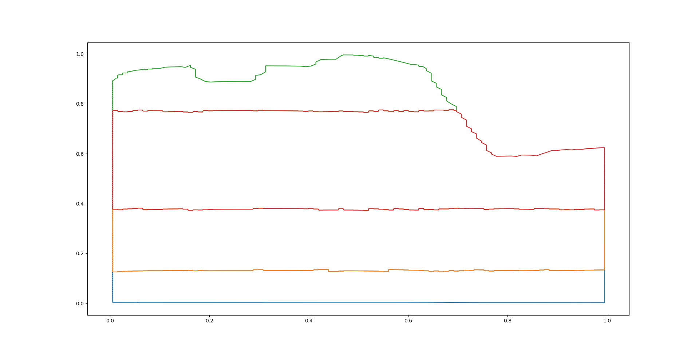

Cluster 2d surface to create polygons for DSeries models
========================================================

In this tutorial the process of the 2d surface clustering is explained.
This refers to the :py:class:`Datafusiontools.d_series_parser.clustering.ClusteringLayers` class.
The user can cluster a list of point with a certain value by using the method
:py:meth:`Datafusiontools.d_series_parser.clustering.ClusteringLayers.cluster_2d_surface`.

In this tutorial we will go through the steps followed internally by this method.
We start with an example surface of a dike segment and the IC value. As it is seen in
the figure that follows

.. raw:: html
   :file: ../_static/dikesegment.html

Step 1: Call from the user
--------------------------

The user calls the clustering function as follows:

.. code-block:: python

    cluster_model = ClusteringLayers()
    cluster_model.cluster_2d_surface(points_2d_slice,
                                         k_candidates=4,
                                         cluster_variables=["value"],
                                         spatial_connectivity_methods=libpysal.weights.Queen)

Step 2: Normalizing the data
----------------------------

All data points and value are normalised by the function
:py:meth:`Datafusiontools.d_series_parser.clustering.ClusteringLayers.normalise_data` .

Step 3: Clustering with the Spatially Constrained Hierarchical Clustering method
--------------------------------------------------------------------------------

At this point the clustering method begins  based on the Spatially Constrained Hierarchical Clustering method.
More on that method can be read on https://geographicdata.science/book/notebooks/10_clustering_and_regionalization.html

Step 3.1 : Create Voronoi regions and polygonize them
+++++++++++++++++++++++++++++++++++++++++++++++++++++

In this step the Voronoi regions are created to facilitate the clustering. These regions are turned into polygons
that can be clustered and merged efficiently. In the following plot the resulting polygons are plotted.

Step 3.1 : Create the spatial connectivity matrix
+++++++++++++++++++++++++++++++++++++++++++++++++

The polygons shown in the figure above will be used to construct a connectivity weight matrix.
The weight matrix will be used as a "guide" from the clustering method.
Different spatial weight matrix methods can be found in the libpysal website ( https://pysal.org/libpysal/api.html )

Using the Queen method,
the adjacency relationships can be visualized in the following graph we can observe that every polygon is essentially only
connected to the polygons that are next to it.

This claim is further supported by the fact that the neighboring polygons are ranging between 3 and 7, with
6 being the most common number of neighbors.

Using the KNN method and the clustering inputs of the x, y and IC value, we observe that the connectivity matrix is
biased towards the y dimension.

Step 3.1 : Perform the clustering using the Agglomerative Clustering method
+++++++++++++++++++++++++++++++++++++++++++++++++++++++++++++++++++++++++++

In this method we use the Agglomerative Clustering method as clustering method because the weight matrix can be used as input.
In this case with 4 clusters used this leas to the following results

Step 4: Polygons are created by merging clusters
------------------------------------------------

The small polygons are grouped by each cluster group and they are merged together.

Step 5: Polygons are simplified
-------------------------------

The polygons are simplified by using the Douglas-Peucker algorithm. 

 .. image:: ../_static/simplifiedpolygons.png

Step 6: IC values per polygon are extracted
-------------------------------------------

The mean and standard deviation of the points included in the polygon are extracted.

