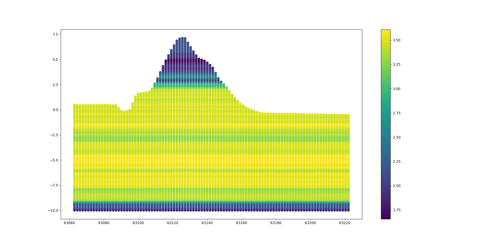
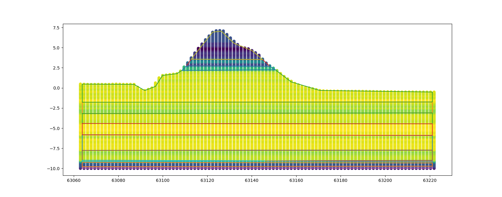
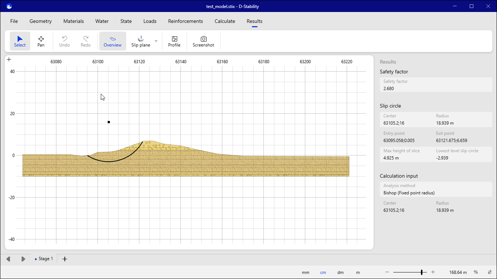

reate D-Stability .sli file from the DataFusionTools
======================================================

By following the tutorial :doc:`tutorial_interpolation_2d_slice.rst` the user can create a 2D interpolated slice
that consists of points and variables. 

In this tutorial we will use the same principles to create a D-Stability file with layers that correspond to clustered points.

First all the required packages should be imported.

.. code-block:: python

    from datafusiontools._core.data_input import Data, Variable, Geometry
    from datafusiontools._core.utils import CreateInputsML, AggregateMethod
    from datafusiontools.spatial_utils import SpatialUtils, TypesAhn
    from datafusiontools.interpolation.interpolation_2d_slice import Interpolate2DSlice
    from datafusiontools.interpolation.interpolation import Nearest
    from datafusiontools.spatial_utils.ahn_utils import SpatialUtils
    import SpatialUtilsfrom datafusiontools.d_series_parser.clustering
    import ClusteringLayersfrom datafusiontools.d_series_parser.d_stability_parser
    import DStabilityModel

    import libpysal
    import numpy as np
    import pickle
    from pathlib import Path
    import matplotlib.pyplot as plt

The data were stored in a :download:`pickle <../_static/test_case_DF.pickle>` file.
The pickle file can be opened as follows using python.

.. code-block:: python

        input_files = "test_case_DF.pickle"
        with open(input_files, "rb") as f:
            (cpts, resistivity, insar) = pickle.load(f)

After all data are extracted from the pickle file, they will be reorganized into lists of :class:`datafusiontools._core.data_input.Data`
The cpts are extracted in the following way:

.. code-block:: python

    cpts_list = []
    for name, item in cpts.items():
        location = Geometry(x=item["coordinates"][0], y=item["coordinates"][1], z=0)
        cpts_list.append(
            Data(
                location=location,
                independent_variable=Variable(value=item["NAP"], label="NAP"),
                variables=[
                    Variable(value=item["water"], label="water"),
                    Variable(value=item["tip"], label="tip"),
                    Variable(value=item["IC"], label="IC"),
                    Variable(value=item["friction"], label="friction"),
                ],
            )
        )

In this case the AHN surface line can be extracted using the following code snippet.
In this case the surface line is between points <63222, 387725> and <63063, 38772>.
The 

.. code-block:: python

    # locations are defined 
    location_1 = Geometry(x=63222, y=387725, z=0)
    location_2 = Geometry(x=63063, y=387725, z=0)
    # using the spatial utils the AHN surface line is extracted
    spatial_utils = SpatialUtils()
    surface_line = [[i, location_2.y]  for i in np.arange(location_2.x,location_1.x,  4)]
    spatial_utils.get_ahn_surface_line(np.array(surface_line))

After that the 2d slice is extracted between locations <63222, 387725> and <63063, 38772>.

.. code-block:: python
    
    #  the interpolator type is defined
    interpolator_slice = Nearest()
    # 2d slice with all points is extracted
    interpolator = Interpolate2DSlice()
    points_2d_slice, results_2d_slice = interpolator.get_2d_slice_extra(
        location_1=location_1,
        location_2=location_2,
        data=cpts_list,
        interpolate_variable="IC",
        number_of_points=100,
        number_of_independent_variable_points=120,
        top_surface=spatial_utils.AHN_data,
        bottom_surface= np.array([[location_1.x, location_1.y, -10], [location_2.x, location_2.y, -10]])
    )

These results can be restructured into an array of (n, 3) that contains the interpolated value of the IC

.. code-block:: python

    for counter, points in enumerate(points_2d_slice):
        for double_count, row in enumerate(points_2d_slice[counter]):
            row.append(results_2d_slice[counter][double_count])
            points_2d_slice[counter][double_count] = row
    points_2d_slice = np.array(points_2d_slice)
    points_2d_slice = np.reshape(points_2d_slice, (points_2d_slice.shape[0]*points_2d_slice.shape[1], 4))
    points_2d_slice = np.array([points_2d_slice.T[0,:], points_2d_slice.T[2,:], points_2d_slice.T[3,:]]).T

Let's take a look at the results of the interpolated 2d slice this can be done by following the code snippet bellow.

.. code-block:: python

    fig = plt.figure()
    ax = fig.add_subplot(111)
    ax.scatter(np.array(points_2d_slice).T[0],np.array(points_2d_slice).T[1],c=np.array(points_2d_slice).T[2])
    plt.show()

The different values of the IC can be seen in the figure bellow. In this case the most logical outcome 
would be to split the geometry into three or four different polygons.

The clustered 2d surface can be extracted by running the cluster_2d_surface_agglomerative_clusterin
and defining the k_candidates inputs for the clustering. Also the cluster_variables should be defined
as the variable that should be clustered. In this case the IC value is used. Another option would be
to select the "x" and "y" variables so that the clustering also takes into account these directions.
The spatial_connectivity_methods can be used to define the connectivity of the points. In this case
the Queen method is used. Note that the method is selected from the libpysal package.

.. code-block:: python

    cluster_model = ClusteringLayers()
    cluster_model.cluster_2d_surface_agglomerative_clusterin(points_2d_slice,
                                                             k_candidates=14,
                                                             cluster_variables=["value"],
                                                             spatial_connectivity_methods=libpysal.weights.Queen)

The results of this analysis are a list of the simplified polygons and the a list of mean value of the clustered layers.

.. code-block:: python

    # polygon list
    cluster_model.simplified_polygons
    # aggregated value per polygon
    cluster_model.extracted_value_per_polygon

The resulting polygons can be plotted on top of the previously shown figure.

By using the IC values that were aggregated we can create soils.
Note that the function shown in the code bellow is for demonstration purpose only and does not hold real geotechnical value.

.. code-block:: python

    def soil_type_from_IC(ic:float):
        """
        Classifies IC based on figure 22 of Robertson, 2010, page 27
        """
        if ic < 1.31:
            return {"name": "dense sand",
                    "code": 7, 
                    "soil_weight_parameters": {"saturated_weight": {"mean": 22}, "unsaturated_weight": {"mean": 17} },
                    "mohr_coulomb_parameters": {"cohesion": {"mean": 1}, "friction_angle": {"mean": 32.5}}
                    }
        elif ic >= 1.31 and  ic < 2.05:
            return {"name": "silty sand",
                    "code": 6, 
                    "soil_weight_parameters": {"saturated_weight": {"mean": 22}, "unsaturated_weight": {"mean": 17} },
                    "mohr_coulomb_parameters": {"cohesion": {"mean": 1}, "friction_angle": {"mean": 30}}
                    }
        elif ic >= 2.05 and  ic < 2.6:
            return {"name": "sandy silt",
                    "code": 5, 
                    "soil_weight_parameters": {"saturated_weight": {"mean": 21}, "unsaturated_weight": {"mean": 19} },
                    "mohr_coulomb_parameters": {"cohesion": {"mean": 1}, "friction_angle": {"mean": 29}}
                    }
        elif ic >= 2.6 and  ic < 2.95:
            return {"name": "silty clay",
                    "code": 4, 
                    "soil_weight_parameters": {"saturated_weight": {"mean": 20}, "unsaturated_weight": {"mean": 19} },
                    "mohr_coulomb_parameters": {"cohesion": {"mean": 1}, "friction_angle": {"mean": 27}}
                    }
        elif ic >= 2.95 and  ic < 3.6:
            return {"name": "silty clay",
                    "code": 3, 
                    "soil_weight_parameters": {"saturated_weight": {"mean": 18}, "unsaturated_weight": {"mean": 18} },
                    "mohr_coulomb_parameters": {"cohesion": {"mean": 1}, "friction_angle": {"mean": 27}}
                    }
        else:
            return {"name": "Organic soil",
                    "code": 2, 
                    "soil_weight_parameters": {"saturated_weight": {"mean": 13}, "unsaturated_weight": {"mean": 13} },
                    "mohr_coulomb_parameters": {"cohesion": {"mean": 1}, "friction_angle": {"mean": 15}}
                    }

Using this function the dictionaries for the soil layers in D-Stability can be defined. 
This collection of polygons can be exported to a D-Stability model by using the following code snippet.

.. code-block:: python

    soils_dictionary  = [soil_type_from_IC(ic_value) for ic_value in cluster_model.extracted_value_per_polygon]
    # set a stix file name
    filename = "test_model.stix"
    # create a default model
    model = DStabilityModel.create_model(cluster_model.simplified_polygons, filename, soils_dictionary)

By opening the stix file from the D-Stability GUI, we can see the results of the clustering.

