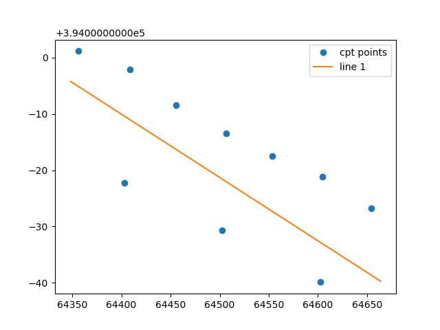
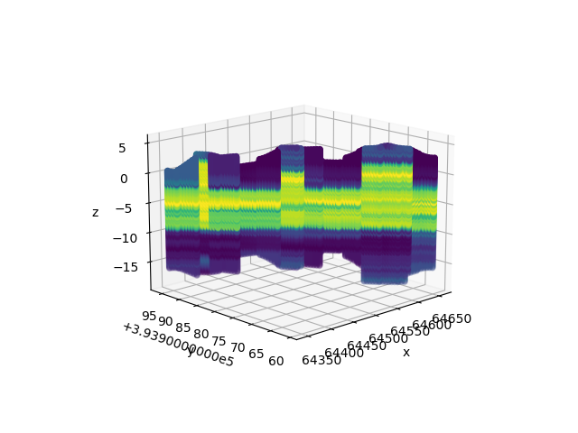
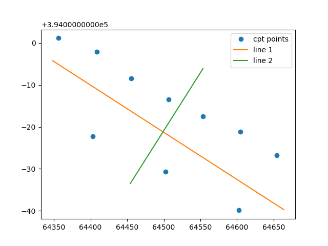
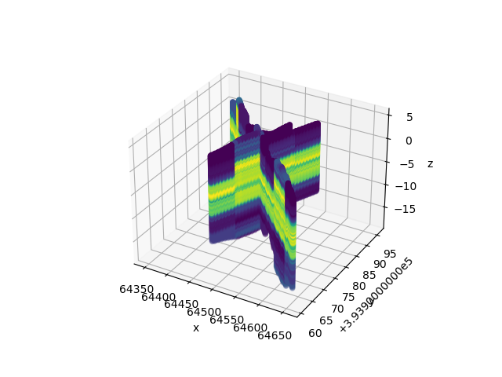
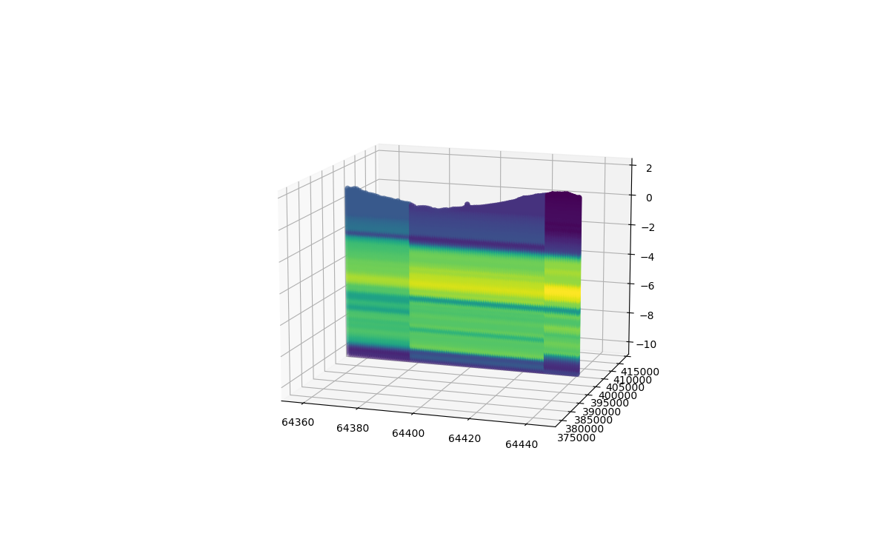

How to get a 2d interpolated slice from a list of data
======================================================

In this tutorial the user will learn how to extract a 2d interpolated slice.
The first step is to import all relevant packages needed for the tutorial.

.. code-block:: python
    
    import numpy as np
    from matplotlib import pyplot as plt
    from mpl_toolkits.mplot3d import Axes3D
    import pickle

    from datafusiontools._core.data_input import Data, Geometry, Variable
    from datafusiontools.interpolation.interpolation_2d_slice import Interpolate2DSlice
    from datafusiontools.interpolation.interpolation import Nearest
    from datafusiontools.spatial_utils.ahn_utils import SpatialUtils

In this example the data will be interpolated using the Nearest Neighbor model.
However the user can use any of the interpolation models included in DataFusionTools or implement their own.

The data were stored in a :download:`pickle <../_static/test_case_DF.pickle>` file.
The pickle file can be opened as follows using python.

.. code-block:: python

        input_files = "test_case_DF.pickle"
        with open(input_files, "rb") as f:
            (cpts, resistivity, insar) = pickle.load(f)

After all data are extracted from the pickle file, they will be reorganized into lists of :class:`datafusiontools._core.data_input.Data`
The cpts are extracted in the following way:

.. code-block:: python

    cpts_list = []
    for name, item in cpts.items():
        location = Geometry(x=item["coordinates"][0], y=item["coordinates"][1], z=0)
        cpts_list.append(
            Data(
                location=location,
                independent_variable=Variable(value=item["NAP"], label="NAP"),
                variables=[
                    Variable(value=item["water"], label="water"),
                    Variable(value=item["tip"], label="tip"),
                    Variable(value=item["IC"], label="IC"),
                    Variable(value=item["friction"], label="friction"),
                ],
            )
        )

After all the data is organized the user must select two points in the x-y plane which will be used as boundaries of the 
2d slice.
The two locations are defined by using the :class:`datafusiontools._core.data_input.Geometry` class.
The locations selected for this example can be seen bellow.

.. code-block:: python

    location_1 = Geometry(x=64348.1, y=393995.8, z=0)
    location_2 = Geometry(x=64663.8, y=393960.3, z=0)

The following image shows the location of the 2d slice to be extracted.

Then the class :func:`DataFusionTools.interpolation.interpolation_2d_slice.Interpolate2DSlice.get_2d_slice_extra` class can be initialized and 
the function.

.. code-block:: python

    interpolator = Interpolate2DSlice()
    points_2d_slice, results_2d_slice = interpolator.get_2d_slice_extra(
        location_1=location_1,
        location_2=location_2,
        data=cpts_list,
        interpolate_variable="IC",
        number_of_points=100,
        number_of_independent_variable_points=120,
        interpolation_method=Nearest()
    )

To view the results the user can create a plot function as the one appended bellow.

.. code-block:: python

    fig = plt.figure()
    ax = fig.add_subplot(111, projection="3d")
    ax.set_xlabel("x")
    ax.set_ylabel("y")
    ax.set_zlabel("z")
    for counter, points in enumerate(points_2d_slice):
        values = results_2d_slice[counter]
        ax.scatter(
            np.array(points).T[0],
            np.array(points).T[1],
            np.array(points).T[2],
            c=values,
        )

Which produces the following figure.

We can also choose a second slice with the same data.
The line can be redefined as it can be seen bellow. 

.. code-block:: python

    location_1 = Geometry(x=64454.3, y=393966.5, z=0)
    location_2 = Geometry(x=64553.6, y=393993.9, z=0)

The following image shows the locations the first and second 2d slices to be extracted.

The function    
:func:`DataFusionTools.interpolation.interpolation_2d_slice.Interpolate2DSlice.get_2d_slice_extra`
has to be called again as it can be seen in the following snippet.

.. code-block:: python

    points_2d_slice, results_2d_slice = interpolator.get_2d_slice_extra(
        location_1=location_1,
        location_2=location_2,
        data=cpts_list,
        interpolate_variable="IC",
        number_of_points=100,
        number_of_independent_variable_points=120,
        interpolation_method=Nearest()
    )

The results of the last slice can be added in the previously created plot.

.. code-block:: python

    for counter, points in enumerate(points_2d_slice):
        values = results_2d_slice[counter]
        ax.scatter(
            np.array(points).T[0],
            np.array(points).T[1],
            np.array(points).T[2],
            c=values,
        )
    
    plt.show()

Which produces the following figure.

Note that the user can also input their own surface line in the in the :func:`DataFusionTools.interpolation.interpolation_2d_slice.Interpolate2DSlice.get_2d_slice_extra` function.
For example the user can use the functionality of extracting surfaces from the AHN and using those set of points as an input.
The points are extracted from the DTM map of the AHN. Note values that are larger that +323m and smaller than -7m are filtered
out of the data.

In the following code snippet the locations of the slice are defined.
As well as the surface line that is extracted from the AHN.

.. code-block:: python

    location_1 = Geometry(x=64358.1, y=393995, z=0)
    location_2 = Geometry(x=64443.8, y=393995, z=0)
    spacial_utils = SpatialUtils()
    surface_line = []
    for i in np.arange(location_1.x,location_2.x,  1):
        surface_line.append([i, location_1.y])
    surface_line = np.array(spacial_utils.get_ahn_surface_line(np.array(surface_line)))

The bottom line can be defined as a horizontal line at -10m.

.. code-block:: python

    bottom_line =  np.array([[location_1.x, location_1.y, -10], [location_2.x, location_2.y, -10]])

The same function is called as in the case above.

.. code-block:: python

        points_2d_slice, results_2d_slice = interpolator.get_2d_slice_extra(
            location_1=location_1,
            location_2=location_2,
            data=cpts_list,
            interpolate_variable="IC",
            number_of_points=100,
            number_of_independent_variable_points=120,
            top_surface=surface_line,
            bottom_surface=bottom_line
        )

Which produces the following figure.

