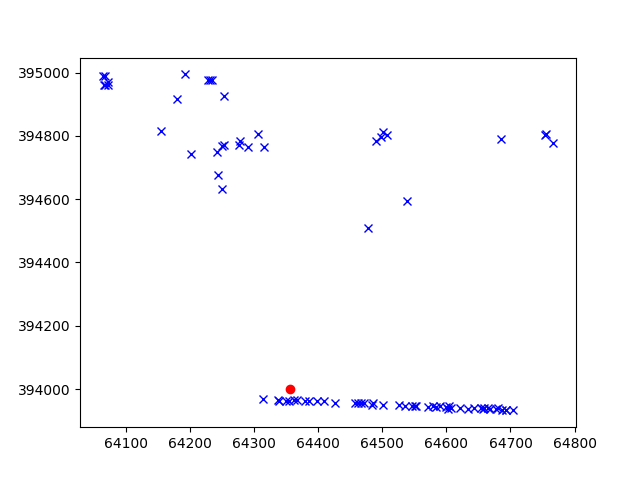
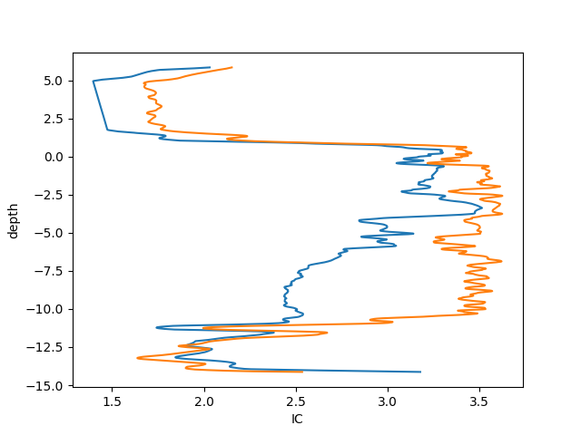

Tutorial neural network
=======================

This tutorial uses sets of data to train a Neural Network (NN),
to predict the IC value of a cpt.
The first step of this process is to import all necessary package needed
for setting up the model.

.. code-block:: python

    from datafusiontools._core.data_input import Data, Variable, Geometry
    from datafusiontools._core.utils import CreateInputsML, AggregateMethod
    from datafusiontools.machine_learning.mpl import MPL
    import datafusiontools.machine_learning.enumeration_classes as class_enums

    import pickle
    import matplotlib.pyplot as plt
    from pathlib import Path

The data were stored in a :download:`pickle <../_static/test_case_DF.pickle>` file.
The pickle file can be opened as follows using python.

.. code-block:: python

        input_files = "test_case_DF.pickle"
        with open(input_files, "rb") as f:
            (cpts, resistivity, insar) = pickle.load(f)

After unpacking the pickle file the topography can be plotted in x and y space.
This can be done by using the following function.

.. code-block:: python

    def plot_topography(cpts, resistivity, insar, path):
        # plot everything that is available
        for name, cpt in cpts.items():
            cpt_point = cpt["coordinates"]
            plt.plot(
                [cpt_point[0]], [cpt_point[1]], marker="o", markersize=3, color="blue"
            )
        for name, res in resistivity.items():
            plt.plot(
                [res["coordinates"][0]],
                [res["coordinates"][1]],
                marker="o",
                markersize=3,
                color="red",
            )
        for insar_value in insar["coordinates"]:
            plt.plot(
                [insar_value[0]],
                [insar_value[1]],
                marker="o",
                markersize=3,
                color="green",
            )
        plt.savefig(Path(path, "topography.png"))
        plt.close()

        plot_topography(cpts, resistivity, insar, Path("test_tutorial"))

The following figure is produced. In the figure the blue points
represent the positions of the cpts, the red point the
positions of the resistivity and finally the green points
represent the insar values

After all data are extracted from the pickle file, they will be reorganized into lists of :class:`datafusiontools._core.data_input.Data`
The cpts are extracted in the following way:

.. code-block:: python

    cpts_list = []
    for name, item in cpts.items():
        location = Geometry(x=item["coordinates"][0], y=item["coordinates"][1], z=0)
        cpts_list.append(
            Data(
                location=location,
                independent_variable=Variable(value=item["NAP"], label="NAP"),
                variables=[
                    Variable(value=item["water"], label="water"),
                    Variable(value=item["tip"], label="tip"),
                    Variable(value=item["IC"], label="IC"),
                    Variable(value=item["friction"], label="friction"),
                ],
            )
        )

The resistivity data are extracted as follows:

.. code-block:: python

    resistivity_list = []
    for name, item in resistivity.items():
        location = Geometry(x=item["coordinates"][0], y=item["coordinates"][1], z=0)
        resistivity_list.append(
            Data(
                location=location,
                independent_variable=Variable(value=item["NAP"], label="NAP"),
                variables=[
                    Variable(value=item["resistivity"], label="resistivity")
                ],
            )
        )

The insar data are extracted in a similar manner:

.. code-block:: python

    insar_list = []
    for counter, coordinates in enumerate(insar["coordinates"]):
        location = Geometry(x=coordinates[0], y=coordinates[1], z=0)
        insar_list.append(
            Data(
                location=location,
                independent_variable=Variable(value=insar["time"], label="time"),
                variables=[
                    Variable(
                        value=insar["displacement"][counter], label="displacement"
                    )
                ],
            )
        )

After that the features can be produced by initializing the class
:class:`datafusiontools._core.utils.CreateInputsML`.

.. code-block:: python

    create_features = CreateInputsML()

The :class:`datafusiontools._core.utils.CreateInputsML` class gives the user the functionality to "fuse" data together.
The first tasks is to combine insar data with the cpt data together. For that we will use the function :py:meth:`datafusiontools._core.utils.CreateInputsML.find_closest_point`.
This function finds a given amount of points that are closest to the original data (in this case the cpt).
Then the function aggregates the data of the closest point to produce a result for the cpt target point.

Let's take for example a cpt point which is surrounded my insar data.

The function extracts the 10 closest insar points to the cpt.

Then the values of each point are aggregated on the insar points.

Which are later aggregated on the cpt point.

This process can be reproduced by using the following code snippet.
Note that here the aggregation method sum is used for the value "displacement".
The result of this function is actually a list of :class:`datafusiontools._core.data_input.Data`.

.. code-block:: python

    aggregated_features = create_features.find_closer_points(
        input_data=cpts_list,
        combined_data=insar_list,
        aggregate_method=AggregateMethod.SUM,
        interpolate_on_independent_variable=False,
        aggregate_variable="displacement",
        number_of_points=10,
    )

The process can also be extended with the resistivity input.
The resistivity input can be interpolated in depth. In this case
the setting interpolate_on_independent_variable is set to True.
In terms of code this is achieved as it is shown in the following snippet.
Note that in this case we use the already aggregate results of the previous step.

.. code-block:: python

    aggregated_features = create_features.find_closer_points(
        input_data=aggregated_features,
        combined_data=resistivity_list,
        aggregate_method=AggregateMethod.MAX,
        aggregate_variable="resistivity",
        interpolate_on_independent_variable=True,
        number_of_points=10,
    )

In this case the ten closest resistivity measurements are selected.

.. image:: ../_static/closer_points_res.png

Since the interpolate_on_independent_variable is set to True, the resistivity value is interpolated over the depth of the cpt.

According the aggregation method selected , in this case MEAN, for each depth point (or independent variable point) the mean value of
the resistivity is selected.

For each cpt of the database the features and targets of the training can be added.
In this case the the inputs of the Neural Network are the resistivity, displacement, depth and the location.
To achieve that the add_features method can be used.
The input use_independent_variable is set to True, that will lead to the depth being used as an input.
The input use_location_as_input is also set to True, that will lead to the location being used as an input.

.. code-block:: python

        for aggregated_feature in aggregated_features:
            create_features.add_features(
                aggregated_feature,
                ["tip", "displacement", "resistivity"],
                use_independent_variable=True,
                use_location_as_input=(True, True, False),
            )
            create_features.add_targets(aggregated_feature, ["IC"])

The user can retrieve all features and targets by using the functions of the
following code snippet. In this case the features and targets are flattened.
This suggests that the input of the Neural Network will be per depth location.

.. code-block:: python

    create_features.get_all_features(flatten=False)
    create_features.get_all_targets(flatten=False)

Then the features and targets can be split into training and testing dataset.
To do that the method :py:meth:`datafusiontools._core.utils.CreateInputsML.split_train_test_data`.
In the following code snippet this procedure is shown.

.. code-block:: python

    create_features.split_train_test_data()
    training_data = create_features.get_features_train(flatten=False)
    target_data = create_features.get_targets_train(flatten=False)
    validation_training = create_features.get_features_test(flatten=False)
    validation_target = create_features.get_targets_test(flatten=False)

The user can also extract the feature names after defining all the testing and training data.

.. code-block:: python

    feature_names = create_features.get_feature_names()

In this case the model used for training is a simple NN model.
This can be initialized by using the :class:`datafusiontools.machine_learning.mpl.MPL` class.

.. code-block:: python

    nn = MPL(
        classification=False,
        nb_hidden_layers=2,
        nb_neurons=[28, 14],
        activation_fct=class_enums.ActivationFunctions.relu,
        optimizer=class_enums.Optimizer.Adam,
        loss=class_enums.LossFunctions.mean_squared_error,
        epochs=50,
        batch=1,
        regularisation=0,
        feature_names=feature_names,
    )
    nn.train(
        training_data,
        target_data,
    )

Let's now evaluate the training of the data. The cost function can simply
be plotted by using the :func:`~datafusiontools.machine_learning.neural_networks.NeuralNetwork.plot_cost_function`.

Another way to look at the performance of the NN model is to plot the 1:1 plot
using the testing data we reserved. This is implemented as a method in the
DataFusionTools package. Note that the path is defined by using the pathlib package.

.. code-block:: python

    nn.predict(validation_training)
    nn.plot_fitted_line(
        validation_target, Path("test_tutorial")
    )

    nn.plot_cost_function(Path("test_tutorial"))

In the plot bellow we can see how the model performed.

Finally, we can also plot the IC vs the depth of the CPT, for that purpose the last 50 points can be plotted.

.. code-block:: python

        # extract last cpt data for testing
        plt.clf()
        plt.plot(nn.prediction[:1000], validation_training.T[1][:1000])
        plt.plot(validation_target[:1000], validation_training.T[1][:1000])
        # plot 1/1 line
        plt.xlabel("IC")
        plt.ylabel("depth")
        plt.savefig(Path("test_tutorial", "comparison_depth.png"))
        plt.close()

In the plot bellow we can see how the plot performed.

To explain the contribution of each input to the output of the model,
the user can use the SHAP (SHapley Additive exPlanation) value as a
metric of the feature importance. The Shapley value is the average of
the marginal contributions across all permutations. In this pythonmodule
we use the `shap python module <https://shap.readthedocs.io/en/latest/index.html>`__ ,
to produce feature importance graphs.

To do that the user can use method :func:`~datafusiontools.machine_learning.neural_networks.NeuralNetwork.plot_feature_importance`.
An example of how this function is called is show bellow.

.. code-block:: python

    nn.plot_feature_importance(
            validation_training, Path("test_tutorial")
        )

In the plot bellow we can see how the plot performed.

The plot contains a lot of information.
Firstly, negative and positive relationships with the target variable are shown in the figure.
Each dot represent the one input in the neural network.

* Feature importance: Variables are ranked in descending order.
* Impact: The horizontal location shows whether the effect of that value is associated with a higher or lower prediction.
* Original value: Color shows whether that variable is high (in red) or low (in blue) for that observation.
* Correlation: A high level of the “depth” content has a high and negative impact on the quality rating. The “high” comes from the red color, and the negative impact is shown on the X-axis.