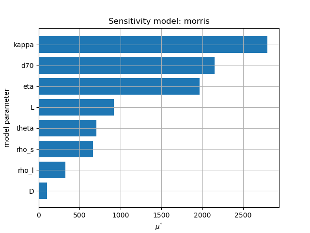
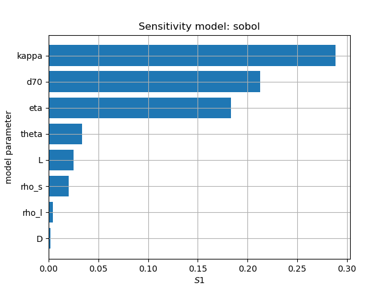
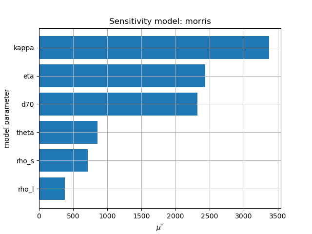

Sensitivity analysis on a model
===============================

This tutorial shows how to use DataFusionTools to perform sensitivity analysis on a model.

First it is necessary to import the datafusion tools packages:

.. code-block:: python

    import numpy as np
    import matplotlib.pylab as plt
    from datafusiontools.sensitivity.sensitivity import Sensitivity, SensitivityMethods

Available methods
~~~~~~~~~~~~~~~~~

There are to methods available to perform the sensitivity analysis:

* `Morris method <https://en.wikipedia.org/wiki/Morris_method>`_
* `Sobol method <https://en.wikipedia.org/wiki/Variance-based_sensitivity_analysis>`_

Application
-----------
To illustrate the use of the methods the Sellmeijer piping model is used.
The Sellmeijer piping model can be imported from:

.. code-block:: python

    from tests.models.piping import SellmeijerRule

To run the Sellmeijer model:

.. code-block:: python

    hc = SellmeijerRule.calculate_critical_head([50, 20, 1e-3, 2e-4, 2650, 1000, 2.50E-01, 37])

where the arguments are:

* L
* D
* kappa
* d70
* rho_s
* rho_l
* eta
* theta

Sensitivity analysis
--------------------
In order to perform a sensitivity analysis it is necessary to define the variables which will be tested, and their ranges.
These need to be defined as a dictionary:

.. code-block:: python

    param_piping = {"names": ["L", "D", "kappa", "d70", "rho_s", "rho_l", "eta", "theta"],
                    "bounds": [[5, 20], [10, 100], [1e-10, 1e-2], [2e-7, 2e-4], [2000, 3000], [900, 1100], [2.5E-2, 2.5], [30, 50]],
                    }

Morris method
~~~~~~~~~~~~~

To perform the sensitivity analysis with the Morris method:

.. code-block:: python

    s = Sensitivity()
    s.define_model(SellmeijerRule.calculate_critical_head, param_piping)
    s.run_sensitivity(SensitivityMethods.Morris)
    s.plot("sensitivity", "Morris.png")

This will create a figure Morris.png on the sensitivity folder.

Sobol method
~~~~~~~~~~~~

To perform the sensitivity analysis with the Sobol method:

.. code-block:: python

    s = Sensitivity()
    s.define_model(SellmeijerRule.calculate_critical_head, param_piping)
    s.run_sensitivity(SensitivityMethods.Sobol)
    s.plot("sensitivity", "Sobol.png")

This will create a figure Sobol.png on the sensitivity folder.

Other uses
~~~~~~~~~~

The sensitivity analysis can also be run with models in which there are fixed variables. For example, for the Sellmeijer model it can be assumed that L and D are constants, and that the sensitivity study is to be performed on the remaining variables.

.. code-block:: python

    param_piping = {"names": ["kappa", "d70", "rho_s", "rho_l", "eta", "theta"],
                    "bounds": [[1e-10, 1e-2], [2e-7, 2e-4], [2000, 3000], [900, 1100], [2.5E-2, 2.5], [30, 50]],
                    }
    L = 20
    D = 50

The fixed variables should be passed in de model definition as last arguments.

.. code-block:: python

    s = Sensitivity()
    s.define_model(SellmeijerRule.calculate_critical_head, param_piping, L, D)
    s.run_sensitivity(SensitivityMethods.Morris)
    s.plot("sensitivity", "Morris_less.png")

Again the results can be visualised. If follows that now no sensitivity is shown for L and D.

